# Re-Own Property Management System - Complete Application Architecture

## 🏗️ High-Level Architecture Overview

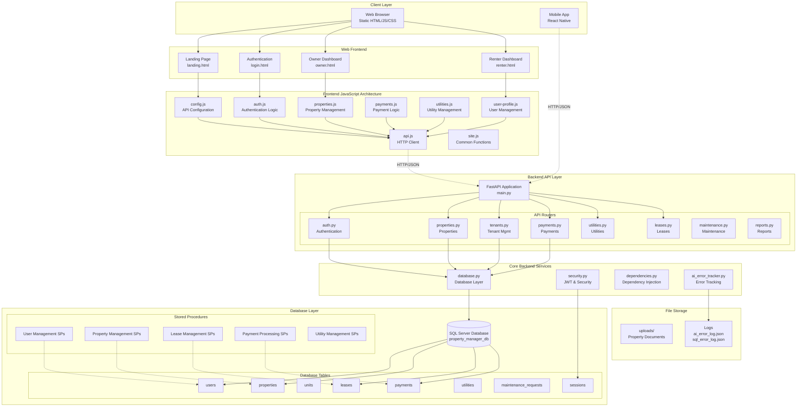

## 🎯 Application Flow & Component Interaction

### 1. Authentication Flow
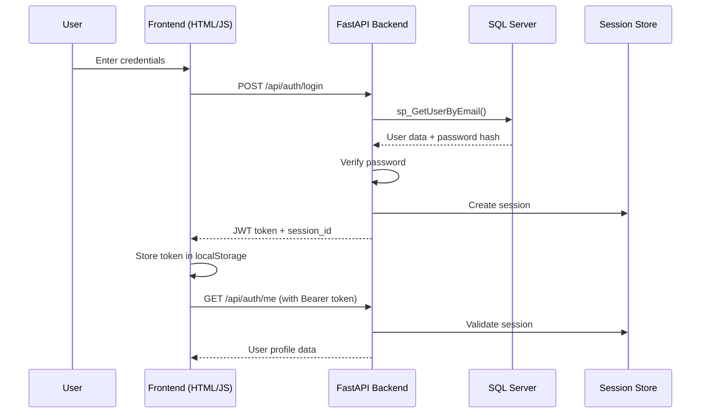

### 2. Property Management Flow
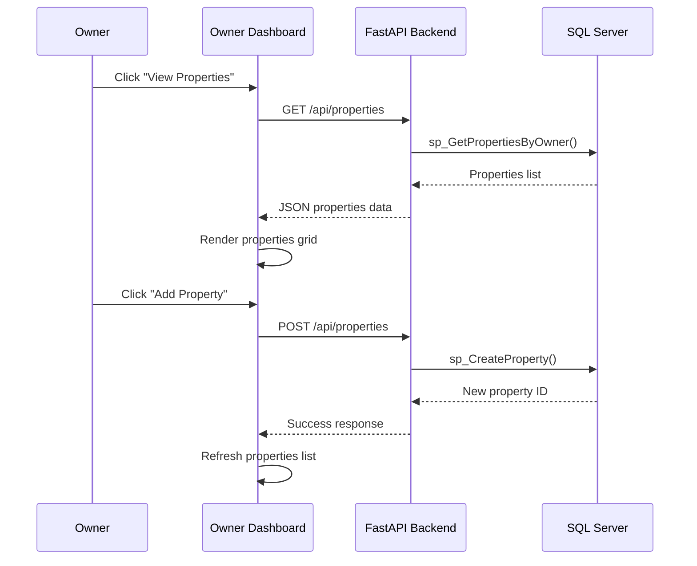

### 3. Tenant Management Flow
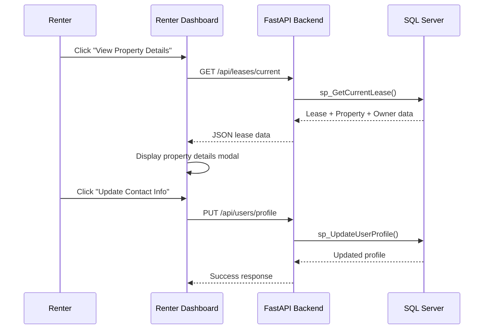

## 🏛️ Database Schema Architecture

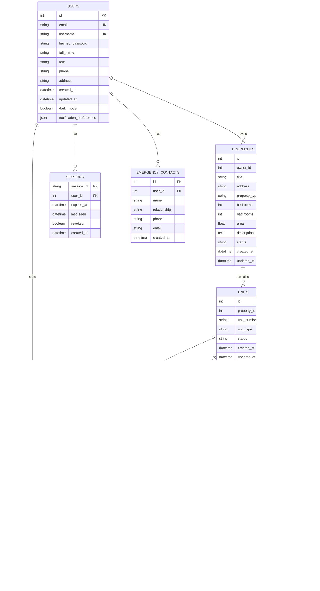

## 📁 File Structure & Organization

```
Re-Own/
├── 📱 Mobile App (React Native)
│   ├── src/
│   │   ├── components/     # Reusable UI components
│   │   ├── navigation/     # Stack & Tab navigators
│   │   ├── screens/        # App screens (Login, Dashboard, etc.)
│   │   ├── services/       # API service layer
│   │   ├── types/          # TypeScript definitions
│   │   └── utils/          # Auth context & utilities
│   ├── android/           # Android-specific configs
│   └── package.json       # Dependencies & scripts
│
├── 🌐 Frontend (Static Web)
│   └── public/
│       ├── 📄 HTML Pages
│       │   ├── landing.html    # Landing/Marketing page
│       │   ├── login.html      # Authentication page
│       │   ├── owner.html      # Owner dashboard
│       │   └── renter.html     # Renter dashboard
│       ├── 🎨 CSS Styles
│       │   ├── style.css       # Global styles & dark mode
│       │   ├── owner.css       # Owner-specific styles
│       │   ├── renter.css      # Renter-specific styles
│       │   └── landing.css     # Landing page styles
│       └── ⚡ JavaScript
│           ├── config.js          # API configuration
│           ├── api.js             # HTTP client & endpoints
│           ├── auth.js            # Authentication logic
│           ├── site.js            # Dark mode & common functions
│           ├── user-profile.js    # User profile management
│           ├── properties.js      # Property management
│           ├── renter-properties.js # Renter property views
│           ├── payments.js        # Payment processing
│           └── utilities.js       # Utility management
│
├── 🔧 Backend (FastAPI)
│   └── app/
│       ├── 🛣️ Routers
│       │   ├── auth.py           # Authentication endpoints
│       │   ├── properties.py     # Property CRUD operations
│       │   ├── tenants.py        # Tenant management
│       │   ├── leases.py         # Lease management
│       │   ├── payments.py       # Payment processing
│       │   ├── utilities.py      # Utility management
│       │   ├── maintenance.py    # Maintenance requests
│       │   └── reports.py        # Analytics & reporting
│       ├── 🏗️ Core
│       │   ├── dependencies.py   # Dependency injection
│       │   └── security.py       # JWT & password handling
│       ├── 📊 Models
│       │   ├── user.py          # User data models
│       │   ├── property.py      # Property data models
│       │   ├── payment.py       # Payment data models
│       │   └── utility.py       # Utility data models
│       ├── 📝 Schemas
│       │   ├── user.py          # Pydantic user schemas
│       │   ├── property.py      # Pydantic property schemas
│       │   ├── payment.py       # Pydantic payment schemas
│       │   └── utility.py       # Pydantic utility schemas
│       ├── database.py          # Database connection & SP execution
│       ├── ai_error_tracker.py  # AI-powered error tracking
│       └── main.py              # FastAPI application entry
│
├── 🗄️ Database
│   ├── database.sql          # Table creation scripts
│   ├── init_database.sql     # Database initialization
│   └── stored_procedures.sql # Stored procedure definitions
│
├── 📚 Documentation
│   └── architecture/
│       ├── system-architecture.md    # System overview
│       ├── sequence-diagrams.md      # Flow diagrams
│       └── COMPLETE_APPLICATION_DIAGRAM.md # This file
│
├── 📁 Uploads
│   └── property_docs/       # Property documents & images
│
├── 🚀 Deployment
│   ├── run.py              # Development server launcher
│   ├── restart.bat         # Windows restart script
│   └── requirements.txt    # Python dependencies
│
└── 📋 Project Files
    ├── README.md           # Project documentation
    ├── reown_pids.json     # Process ID tracking
    ├── ai_error_log.json   # AI error analysis logs
    └── sql_error_log.json  # SQL error logs
```

## 🔄 Data Flow Architecture

### Frontend → Backend Communication
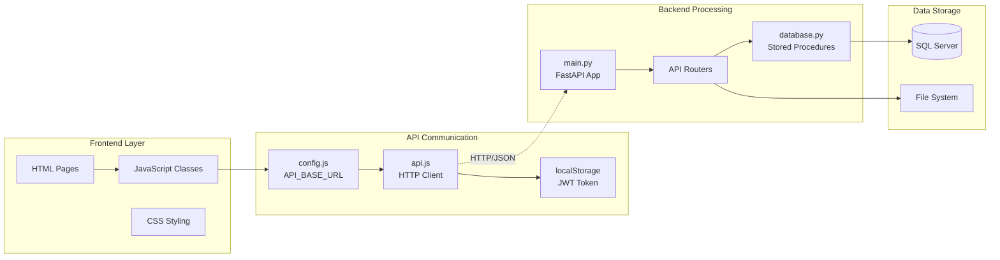

## 🎨 Frontend Architecture Breakdown

### JavaScript Class Structure
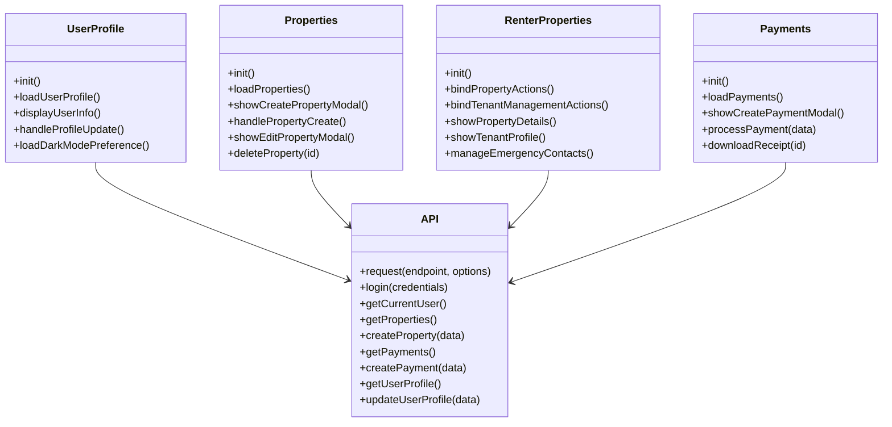

### CSS Architecture
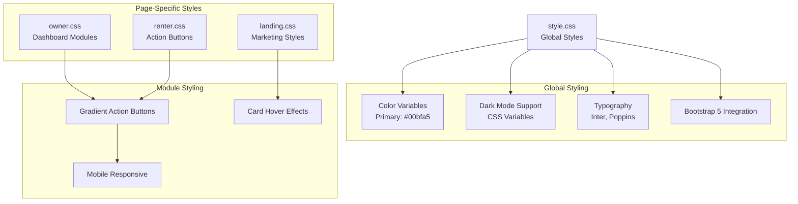

## ⚙️ Backend Architecture Breakdown

### FastAPI Router Structure
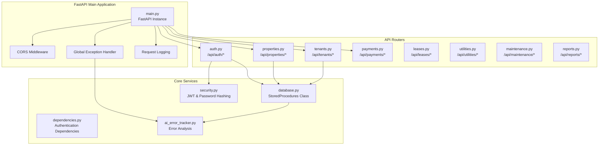

### Database Connection Architecture
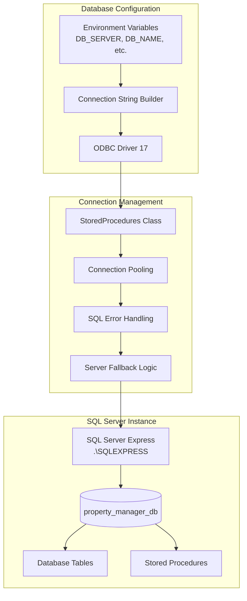

## 🔐 Security Architecture

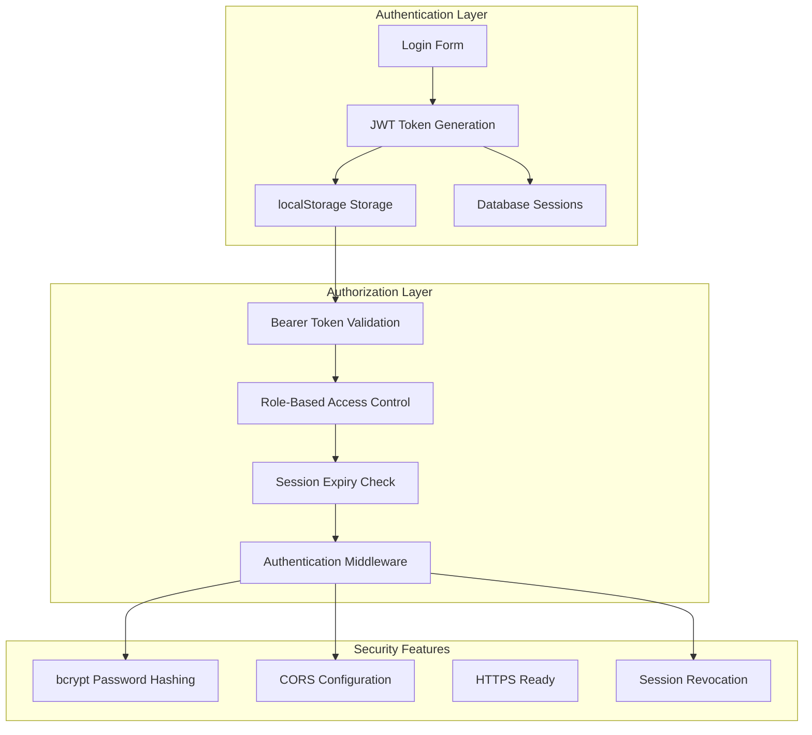

## 📱 Mobile App Architecture

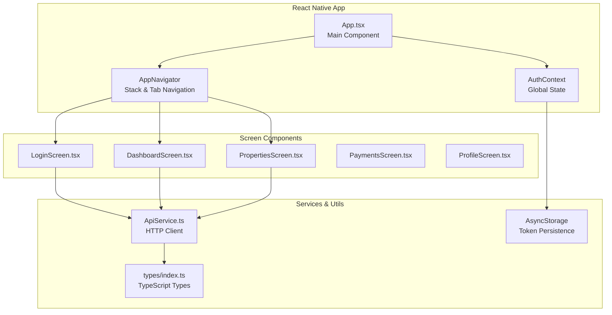

## 🚀 Deployment & Development Architecture

```mermaid
graph TB
    subgraph "Development Environment"
        RUN_PY[run.py<br/>Dev Server Launcher]
        BACKEND_DEV[Uvicorn FastAPI Server<br/>Port 8000]
        FRONTEND_DEV[Python HTTP Server<br/>Port 8080]
        PID_TRACKING[reown_pids.json<br/>Process Management]
    end
    
    subgraph "Error Tracking & Monitoring"
        AI_ERROR_LOG[ai_error_log.json<br/>AI Error Analysis]
        SQL_ERROR_LOG[sql_error_log.json<br/>SQL Error Tracking]
        DEBUG_ENDPOINTS[/debug/errors<br/>/debug/sql-errors]
    end
    
    subgraph "Database Management"
        INIT_SCRIPTS[Database Initialization<br/>database.sql]
        STORED_PROC_SCRIPTS[Stored Procedures<br/>stored_procedures.sql]
        DB_CONNECTION_TEST[Connection Health Check]
    end
    
    RUN_PY --> BACKEND_DEV
    RUN_PY --> FRONTEND_DEV
    RUN_PY --> PID_TRACKING
    
    BACKEND_DEV --> AI_ERROR_LOG
    BACKEND_DEV --> SQL_ERROR_LOG
    BACKEND_DEV --> DEBUG_ENDPOINTS
    
    BACKEND_DEV --> INIT_SCRIPTS
    BACKEND_DEV --> STORED_PROC_SCRIPTS
    BACKEND_DEV --> DB_CONNECTION_TEST
```

## 🔗 Integration Points & API Contracts

### Key API Endpoints
```
Authentication:
├── POST /api/auth/login           # User login
├── POST /api/auth/register        # User registration
├── POST /api/auth/logout          # User logout
└── GET  /api/auth/me              # Current user info

Properties:
├── GET    /api/properties         # List properties
├── POST   /api/properties         # Create property
├── PUT    /api/properties/:id     # Update property
└── DELETE /api/properties/:id     # Delete property

Tenant Management:
├── GET  /api/leases/current       # Current lease info
├── POST /api/leases/assign        # Assign property to tenant
├── GET  /api/users/profile        # User profile
├── PUT  /api/users/profile        # Update profile
├── GET  /api/users/emergency-contacts  # Emergency contacts
└── POST /api/users/emergency-contacts  # Add emergency contact

Utilities & Payments:
├── GET  /api/payments             # Payment history
├── POST /api/payments             # Create payment
├── GET  /api/utilities            # Utility readings
└── POST /api/utilities            # Add utility reading
```

## 📈 Data Flow Summary

1. **User Access**: Browser loads static HTML/CSS/JS from port 8080
2. **Authentication**: JavaScript sends credentials to FastAPI on port 8000
3. **Session Management**: JWT tokens stored in localStorage, sessions in SQL Server
4. **Data Operations**: JavaScript classes make API calls to FastAPI routers
5. **Database Interaction**: FastAPI uses StoredProcedures class to execute SQL procedures
6. **Response Handling**: JSON responses processed by frontend and displayed to user
7. **Error Tracking**: All errors logged and analyzed by AI error tracking system
8. **File Management**: Property documents stored in uploads/ directory
9. **Mobile Access**: React Native app connects to same FastAPI backend
10. **Dark Mode**: User preferences stored in database and synchronized across sessions

This architecture provides a scalable, maintainable, and feature-rich property management system with comprehensive user interfaces for both owners and renters, robust backend APIs, and proper security implementations.