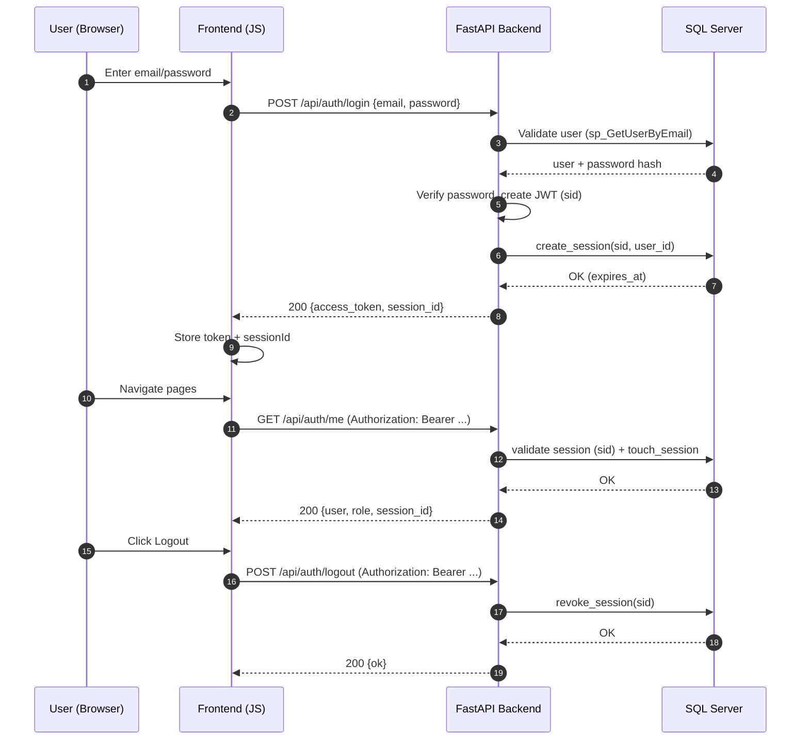
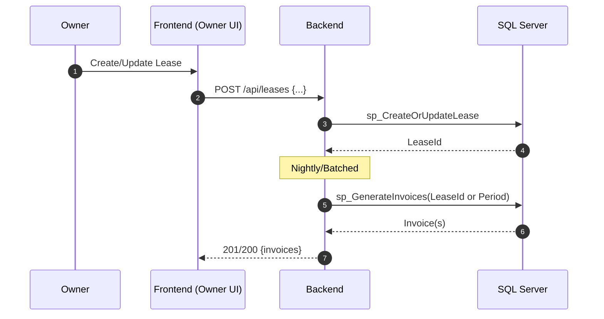
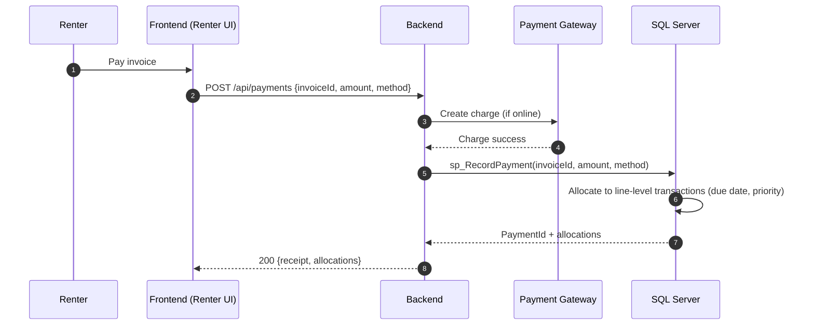
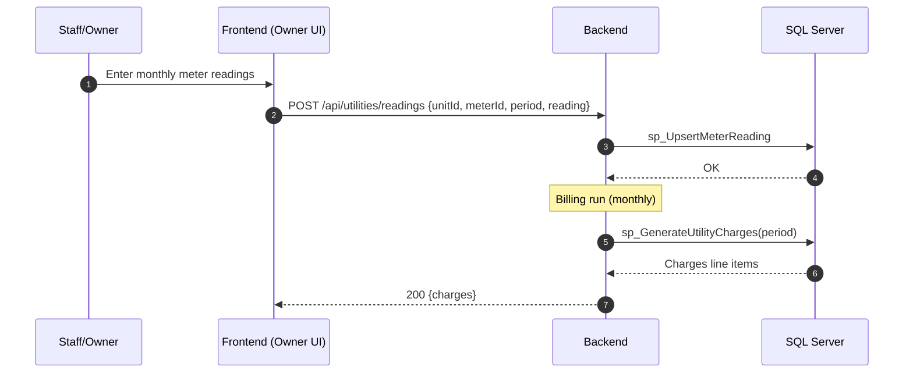
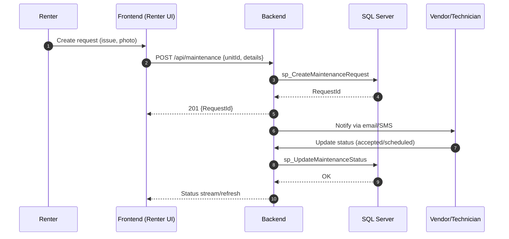

# Sequence Diagrams

This document outlines key end-to-end flows across the system.

## 1) Authentication: Login → Session → Me → Logout



## 2) Lease → Invoice Generation



## 3) Payment Allocation to Transactions



## 4) Utility Meter Reading → Billing



## 5) Maintenance Request Lifecycle



## 6) Session Expiry and Sliding Window

```mermaid
sequenceDiagram
  autonumber
  participant FE as Frontend
  participant API as Backend
  participant DB as SQL Server

  loop On each authorized request
    FE->>API: GET /api/...
    API->>DB: Validate sid and expiry
    DB-->>API: OK; update last_seen, extend expires_at
    API-->>FE: 200 response
  end
  Note over API,DB: Revocation or expiry returns 401/403
```

## Notes
- The repo currently uses FastAPI + SQL Server + pyodbc; adjust SP names to fit your DB naming.
- If you want, we can add sequence diagrams for: Owner onboarding, Unit assignment, Reporting/Exports, Notification digests.
