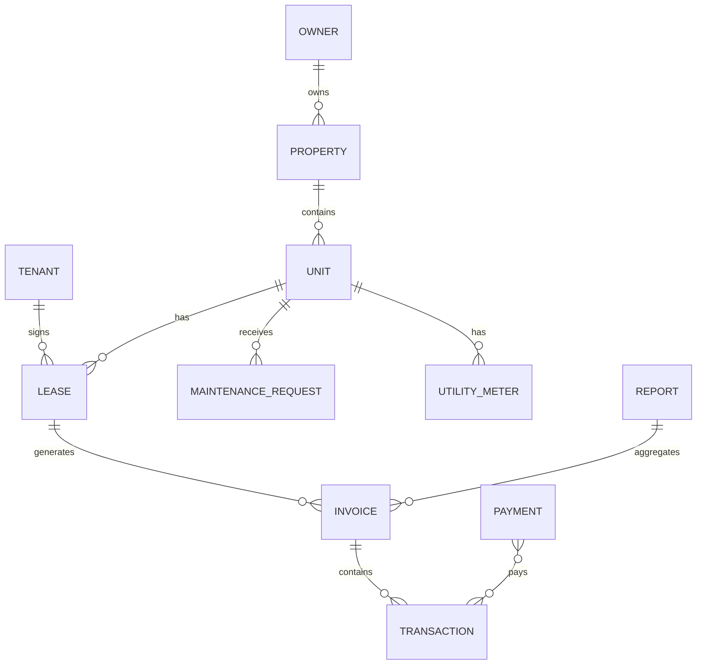

# Property Management System Architecture

This document captures the provided system architecture and data relationship model, with links to screens and deep-link IDs wired in the UI.

## Overview

- Authentication: MFA, RBAC, session management, password recovery, audit logging
- Database Layer: SQL (current repo uses SQL Server via pyodbc), encryption, backups, ACID, stored procedures
- Web Interface: Frontend is static HTML/JS with Bootstrap now; can evolve to SPA (React) or PWA; Mobile possible via React Native/Ionic
- Core Business Logic: rent calc, invoice gen, payments, notifications, reporting, utility billing

## Role-based Views

- Owner:
  - Dashboard analytics, financial overview, tenant management, reporting
  - Deep-link anchors in owner.html:
    - #owner-property, #owner-tenant, #owner-utilities, #owner-payments, #owner-notify, #owner-analytics, #owner-settings
- Renter:
  - Personal dashboard, payment history, docs access, issue reporting
  - Deep-link anchors in renter.html:
    - #renter-property, #renter-payments, #renter-utilities, #renter-notify, #renter-maintenance, #renter-docs, #renter-settings

## Data Relationship Model (ER)

## Cross-page Linking Contract

The UI supports deep-linking via query parameters (normalized):

- tenantId (aliases: renterId, renter_id, tenant_id)
- ownerId
- propertyId
- unitId (aliases: unit_id, flatId, flat_id)
- leaseId
- invoiceId
- transactionId
- maintenanceId (aliases: requestId)
- meterId (aliases: utilityMeterId, meter_id)

Anchor resolution:

- Owner:
  - tenantId → #owner-tenant
  - propertyId/unitId → #owner-property
  - meterId → #owner-utilities
  - invoiceId/transactionId → #owner-payments
  - maintenanceId → #owner-notify
- Renter:
  - propertyId/unitId → #renter-property
  - meterId → #renter-utilities
  - invoiceId/transactionId → #renter-payments
  - maintenanceId → #renter-maintenance
  - tenantId → #renter-property

## Next Steps

- Optionally add API endpoints to expand IDs to human-readable context in the banners (e.g., tenant name, unit address)
- Add sequence diagrams for key flows (lease creation, invoice generation, payment posting)
- Consider migrating frontend to SPA (React) as per your diagram when ready

See also: [Sequence Diagrams](./sequence-diagrams.md)
